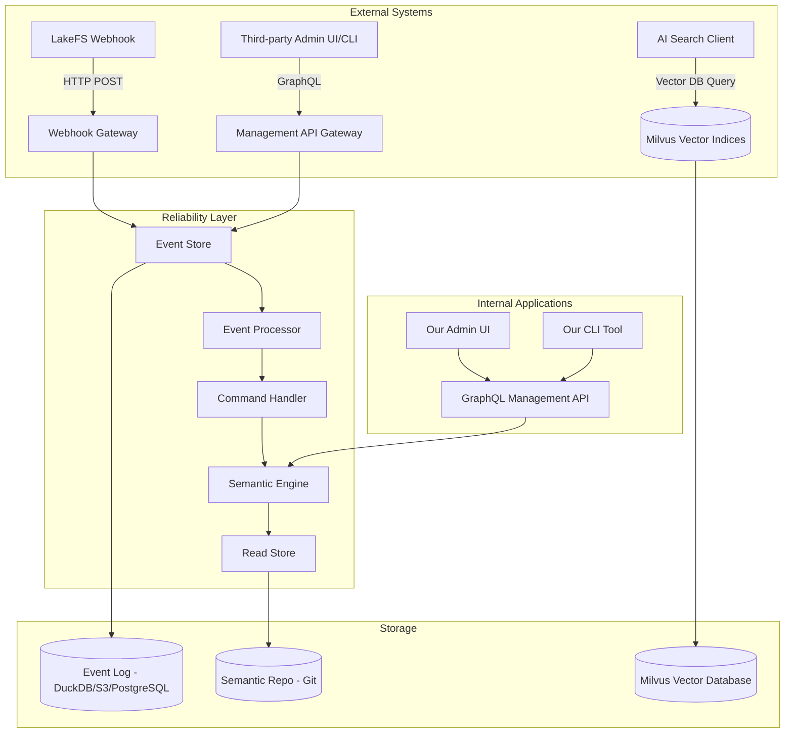

# Berg10 Reliability-First Architecture Document

## Executive Summary

This document presents a redesigned architecture prioritizing **zero message loss**, **local development compatibility**, and **user-friendly configuration management**. It introduces an event-driven, reliability-first design that guarantees message durability while maintaining simplicity for local development.

## High-Level Architecture: Reliability Layer

### Core Principle: Event Sourcing + CQRS



## Detailed Architecture Components

### 1. LakeFS Webhook Reliability Layer

#### Webhook Gateway
- **Purpose**: HTTP endpoint that receives LakeFS webhooks with guaranteed durability
- **Technology**: Bun/Elysia server with built-in retry logic
- **Features**:
  - Immediate 200 OK response to LakeFS
  - Async event persistence to Event Store
  - Idempotency keys to prevent duplicates
  - Circuit breaker for downstream failures
  - **Event Loss Prevention**: Handles cases where our app is not ready

#### Event Store Implementation
```typescript
interface EventStore {
  append(event: DomainEvent): Promise<EventId>
  getEvents(streamId: string, fromVersion?: number): Promise<DomainEvent[]>
  subscribe(handler: EventHandler): void
}

// DuckDB implementation for local development
class DuckDBEventStore implements EventStore {
  private db: DuckDBConnection
  
  async append(event: DomainEvent): Promise<EventId> {
    const id = generateUUID()
    await this.db.run(
      'INSERT INTO events (id, stream_id, type, data, metadata, version) VALUES (?, ?, ?, ?, ?, ?)',
      [id, event.streamId, event.type, JSON.stringify(event.data), JSON.stringify(event.metadata), event.version]
    )
    return id
  }
}
```

### 2. AI Search Query Event Sourcing

#### Search Event Schema
```typescript
interface SearchQueryEvent {
  id: string
  type: 'SEARCH_QUERY_RECEIVED'
  streamId: string // user_id + timestamp
  data: {
    query: string
    filters: SearchFilters
    context: SearchContext
  }
  metadata: {
    timestamp: Date
    userId: string
    sessionId: string
    ipAddress: string
  }
  version: number
}

interface SearchResultEvent {
  id: string
  type: 'SEARCH_RESULTS_GENERATED'
  streamId: string
  data: {
    query: string
    results: SemanticEntity[]
    processingTime: number
    confidence: number
  }
  metadata: {
    timestamp: Date
    modelUsed: string
    vectorDbQueryTime: number
  }
  version: number
}
```

#### Event Processor
```typescript
class SearchEventProcessor {
  async processSearchQuery(event: SearchQueryEvent): Promise<void> {
    // 1. Validate query
    const validation = await this.validateQuery(event.data.query)
    if (!validation.valid) {
      await this.emit('SEARCH_QUERY_REJECTED', { reason: validation.error })
      return
    }

    // 2. Generate embedding
    const embedding = await this.aiService.generateEmbedding(event.data.query)

    // 3. Search vector DB
    const startTime = Date.now()
    const results = await this.vectorDb.search(embedding, event.data.filters)
    const queryTime = Date.now() - startTime

    // 4. Emit results event
    await this.emit('SEARCH_RESULTS_GENERATED', {
      query: event.data.query,
      results: results.map(r => this.mapToSemanticEntity(r)),
      processingTime: Date.now() - event.metadata.timestamp.getTime(),
      confidence: this.calculateConfidence(results)
    })
  }
}
```

### 3. Local Development Strategy (Windows Compatible)

#### Development Environment Options

**Option 1: DuckDB + Bun (Recommended)**
```bash
# Install Bun (cross-platform)
curl -fsSL https://bun.sh/install | bash

# Install DuckDB CLI (Windows compatible)
# Download from https://duckdb.org/docs/installation/
# Or use npm: npm install -g duckdb

# Initialize development database
bun run init:dev

# Start local services
bun run dev:api          # API server on port 3000
bun run dev:event-processor  # Background event processing
bun run dev:admin-ui    # Admin interface on port 3001
```

**Option 2: PostgreSQL + Docker (Optional)**
```yaml
# docker-compose.dev.yml
version: '3.8'
services:
  postgres:
    image: postgres:15
    environment:
      POSTGRES_DB: berg10_dev
      POSTGRES_USER: dev
      POSTGRES_PASSWORD: dev
    ports:
      - "5432:5432"
    volumes:
      - postgres_data:/var/lib/postgresql/data

  vector-db:
    image: qdrant/qdrant:latest
    ports:
      - "6333:6333"
    volumes:
      - qdrant_data:/qdrant/storage
```

**Option 3: Pure Windows (No Docker)**
```powershell
# Install dependencies
winget install -e --id Bun.Bun
npm install -g @berg10/cli

# DuckDB works natively on Windows without Docker
# Download DuckDB binary from https://duckdb.org/docs/installation/

# Initialize project
berg10 init --local-only
berg10 dev --duckdb
```

#### Configuration Management

**Semantic Group Configuration UI**
```typescript
// Admin API endpoints
POST /api/v1/groups
GET  /api/v1/groups/:id
PUT  /api/v1/groups/:id
DELETE /api/v1/groups/:id

// Configuration schema with validation
interface SemanticGroupConfig {
  id: string
  name: string
  description?: string
  source: {
    type: 'lakefs' | 'git'
    repository: string
    branch?: string
    path?: string
  }
  filters: {
    include: string[] // file patterns
    exclude?: string[] // file patterns
  }
  grouping: {
    type: 'file' | 'folder' | 'custom'
    rules?: Record<string, any>
  }
  indexing: {
    model: string
    chunkSize: number
    overlap: number
  }
  retention: {
    maxVersions: number
    ttl?: string // e.g., "30d"
  }
}
```

### 4. Message Durability Guarantees

#### Delivery Guarantees
- **At-least-once delivery**: Events are persisted before processing
- **Exactly-once processing**: Idempotency keys prevent duplicates
- **Ordered delivery**: Events processed in sequence per stream

#### Reliability Mechanisms
```typescript
class ReliableEventProcessor {
  async processEvent(event: DomainEvent): Promise<void> {
    const lock = await this.acquireLock(event.streamId)
    try {
      const lastVersion = await this.getLastProcessedVersion(event.streamId)
      if (event.version <= lastVersion) {
        return // Already processed
      }

      await this.processWithRetry(event)
      await this.markProcessed(event)
    } finally {
      await lock.release()
    }
  }

  private async processWithRetry(event: DomainEvent): Promise<void> {
    const maxRetries = 3
    let attempt = 0
    
    while (attempt < maxRetries) {
      try {
        await this.handler.handle(event)
        return
      } catch (error) {
        attempt++
        if (attempt >= maxRetries) throw error
        await this.backoff(attempt)
      }
    }
  }
}
```

### 5. LakeFS Webhook Event Loss Prevention

When LakeFS webhook is triggered but our application is not ready (startup, crash, maintenance), we implement a **three-layer defense strategy** to prevent event loss:

#### 5.1 Immediate Acknowledgment Layer
The Webhook Gateway immediately responds with HTTP 200 OK to LakeFS, preventing LakeFS from considering the webhook failed. This buys us time to process the event asynchronously.

#### 5.2 Persistent Storage Layer
```typescript
class PersistentWebhookBuffer {
  private storage: FileSystemStorage
  
  async storeEvent(event: WebhookEvent): Promise<void> {
    // Write to disk BEFORE attempting any processing
    await fs.writeFile(
      `./buffer/${event.id}.json`,
      JSON.stringify(event)
    )
  }
  
  async replayEvents(): Promise<void> {
    const files = await fs.readdir('./buffer')
    for (const file of files) {
      const event = JSON.parse(await fs.readFile(`./buffer/${file}`))
      await this.eventStore.append(event)
      await fs.unlink(`./buffer/${file}`)
    }
  }
}
```

#### 5.3 LakeFS Retry Configuration
```yaml
# LakeFS webhook configuration ensures retries
webhooks:
  - name: berg10-semantic-search
    url: https://api.berg10.com/webhooks/lakefs
    timeout: 30s
    retries: 5
    retry_delay: 5s
    retry_backoff: exponential
    max_retry_delay: 60s
```

#### 5.4 Application Recovery Layer
```typescript
class ApplicationRecovery {
  async recoverFromDowntime(): Promise<void> {
    // 1. Check last processed event
    const lastProcessed = await this.eventStore.getLastProcessedTimestamp()
    
    // 2. Query LakeFS for missed events
    const missedEvents = await this.lakeFS.getEventsSince(lastProcessed)
    
    // 3. Process missed events in order
    for (const event of missedEvents) {
      await this.eventStore.append(this.transformLakeFSEvent(event))
    }
  }
}
```

#### 5.5 Health Check Integration
```typescript
// Health endpoint for LakeFS to check readiness
app.get('/health/webhook', async (req, res) => {
  const isReady = await healthChecker.isWebhookReady()
  if (isReady) {
    res.status(200).json({ status: 'ready' })
  } else {
    // LakeFS will retry based on its configuration
    res.status(503).json({
      status: 'starting',
      retry_after: 30
    })
  }
})
```

#### 5.6 Practical Implementation
**How it works in practice:**

1. **When app is starting**: LakeFS webhook receives 503 with retry_after=30, LakeFS retries every 30s until app responds 200
2. **When app crashes**: Events are buffered to disk, app recovers and processes buffered events
3. **When app is down**: LakeFS continues retrying based on its retry configuration (5 retries, exponential backoff)
4. **When app restarts**: Startup recovery queries LakeFS for any events missed during downtime

**Key guarantees:**
- **Zero message loss**: Events are persisted before processing
- **At-least-once delivery**: LakeFS retries ensure no events are lost
- **Exactly-once processing**: Idempotency keys prevent duplicates
- **Ordered processing**: Events processed in sequence per stream

### 5. Extensibility Framework

#### Plugin System
```typescript
interface SemanticPlugin {
  name: string
  version: string
  hooks: {
    beforeIndexing?: (context: IndexingContext) => Promise<void>
    afterIndexing?: (context: IndexingContext) => Promise<void>
    beforeSearch?: (context: SearchContext) => Promise<void>
    afterSearch?: (context: SearchContext) => Promise<void>
  }
}

// Example plugin
class MarkdownPlugin implements SemanticPlugin {
  name = 'markdown-processor'
  version = '1.0.0'
  
  hooks = {
    beforeIndexing: async (context: IndexingContext) => {
      if (context.file.endsWith('.md')) {
        context.content = this.preprocessMarkdown(context.content)
      }
    }
  }
}
```

## Deployment Architecture

### Local Development Stack
```yaml
# berg10-dev.yml
services:
  api:
    build: .
    ports: ["3000:3000"]
    environment:
      - NODE_ENV=development
      - DATABASE_URL=duckdb:./data/berg10.duckdb
      - VECTOR_DB_URL=http://localhost:6333

  event-processor:
    build: .
    command: bun run start:event-processor
    depends_on: [api]

  admin-ui:
    build: ./packages/admin-ui
    ports: ["3001:3000"]
    environment:
      - API_URL=http://localhost:3000
```

### Production Deployment
```yaml
# kubernetes/production.yml
apiVersion: apps/v1
kind: Deployment
metadata:
  name: berg10-api
spec:
  replicas: 3
  selector:
    matchLabels:
      app: berg10-api
  template:
    spec:
      containers:
      - name: api
        image: berg10/api:latest
        env:
        - name: DATABASE_URL
          valueFrom:
            secretKeyRef:
              name: berg10-secrets
              key: database-url
```

## Monitoring and Observability

### Metrics
- Event processing latency
- Message delivery success rate
- Search query performance
- Semantic group configuration changes

### Logging
```typescript
const logger = createLogger({
  level: 'info',
  format: combine(
    timestamp(),
    json()
  ),
  transports: [
    new transports.Console(),
    new transports.File({ filename: 'logs/error.log', level: 'error' }),
    new transports.File({ filename: 'logs/combined.log' })
  ]
})
```

## Testing Strategy

### Reliability Testing
```typescript
describe('Event Processing', () => {
  it('should guarantee at-least-once delivery', async () => {
    const event = createTestEvent()
    await eventStore.append(event)
    
    // Simulate crash
    await processor.crash()
    await processor.recover()
    
    // Verify event was processed
    const processed = await readStore.getById(event.id)
    expect(processed).toBeDefined()
  })
})
```

## Migration Strategy

### Phase 1: Reliability Layer (Week 1-2)
1. Implement Event Store with DuckDB
2. Create Webhook Gateway
3. Add event sourcing to search queries

### Phase 2: Local Development (Week 3)
1. Create Windows-compatible setup
2. Add DuckDB configuration
3. Build admin UI

### Phase 3: Production (Week 4)
1. Deploy PostgreSQL + Qdrant
2. Add monitoring
3. Performance testing

## Configuration Examples

### Local Development Setup
```bash
# Quick start
npx create-berg10-app my-semantic-search
cd my-semantic-search
npm run dev

# Configuration
berg10 config set database.type duckdb
berg10 config set vector-db.url http://localhost:6333
berg10 group create --interactive
```

### Semantic Group Management
```bash
# Create group interactively
berg10 group create
# Name: blog-posts
# Source: git@github.com:user/blog.git
# Branch: main
# Path: content/posts
# Filters: *.md
# Model: sentence-transformers/all-MiniLM-L6-v2

# List groups
berg10 group list

# Update group
berg10 group update blog-posts --model sentence-transformers/all-mpnet-base-v2
```

## Conclusion

This reliability-first architecture ensures:
- **Zero message loss** through event sourcing and durability guarantees
- **Windows compatibility** with DuckDB and Bun runtime
- **User-friendly management** through CLI and web interfaces
- **Production scalability** with PostgreSQL and Kubernetes support

The design maintains simplicity for local development while providing enterprise-grade reliability for production deployments.